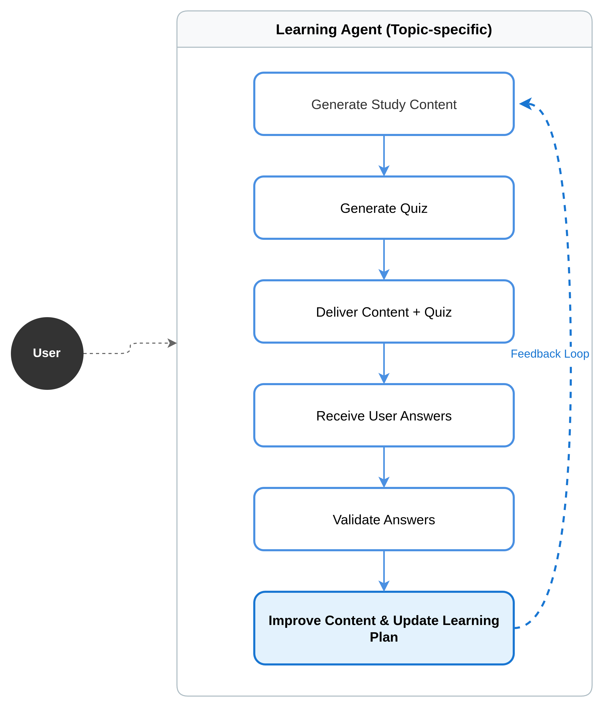

# Platform Agent Architecture

We have two main types of agents operating within the platform:

1. **Orchestrator Agent** – Responsible for coordinating and managing other agents.
2. **Task Execution Models** – The models used by deployed agents to perform their specific tasks.

---

## Orchestrator Agent Workflow

The first agent (the Orchestrator Agent) follows a defined workflow.

The process begins when the user submits a prompt specifying the content they want to study. At this point, the agent can make two possible decisions:

### 1️⃣ Specific Topic Identified

If the agent determines that the requested content is already a **specific topic**, and there is no need to refine it into a more granular sub-area, it proceeds directly.

This is important because each learning agent must be a **specialist in a single, well-defined subject**, rather than covering a broad domain with multiple loosely connected topics.

Once the topic is validated, the agent sends all relevant information to the **MCP server**, which is responsible for creating and deploying a new specialized learning agent containing all the necessary knowledge about that topic.

---

### 2️⃣ Topic Too Broad

If the agent determines that the user’s request refers to a **broad or general topic**, it will not immediately deploy a new agent.

Instead, it will suggest possible **subtopics** that the user may consider studying. Once the user selects a more specific subtopic, the system can then create and deploy a specialized sub-agent focused exclusively on that refined subject.

## Learning Agent Responsibilities

The second agent is responsible for generating the learning content assigned to it, as well as defining the validation method for that content.

The user must complete a questionnaire or assessment, and the agent will evaluate the results to determine how to proceed. By leveraging **RAG-based memory (Retrieval-Augmented Generation)**, the agent analyzes the user’s performance to understand whether they are making progress.

If the user is not progressing as expected, the agent dynamically adjusts its teaching methodology. This adaptive process continues until the user demonstrates clear improvement or mastery of the topic.

